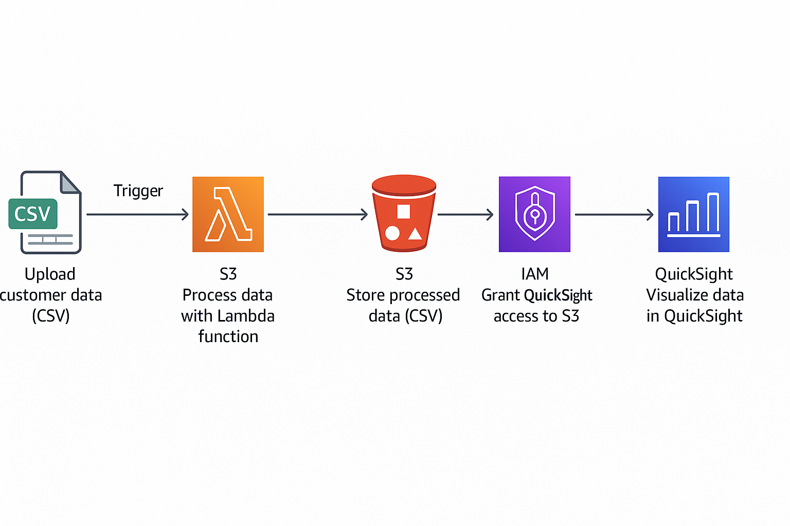
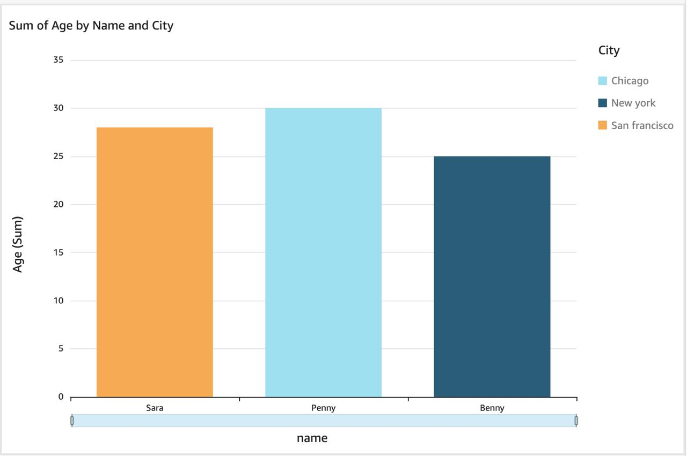

# AWS Serverless CSV Cleaner & Visualizer

This project demonstrates a complete serverless data pipeline using AWS services to clean messy CSV data and visualize the output using Amazon QuickSight.


---

## 🚀 Project Overview

This project demonstrates an event-driven data pipeline using AWS services to clean messy CSV data and visualize the output using Amazon QuickSight.

- 📥 **Input**: User uploads a CSV file to an S3 bucket
- ⚙️ **Processing**: AWS Lambda cleans the file (removes blanks, formats text)
- 📤 **Output**: Cleaned CSV is saved to another S3 bucket
- 📊 **Visualization**: Amazon QuickSight connects to the cleaned file and generates charts

---

## 🧰 Technologies Used

- **AWS Lambda** (Python)
- **Amazon S3**
- **Amazon IAM**
- **Amazon QuickSight**
- **Python csv module**

---

## 🗺️ Architecture Diagram

The pipeline follows this structure:



---

## 📊 Sample Visualization

Bar chart output from Amazon QuickSight showing cleaned CSV data:



---

## 🛠 How to Run This Project

Upload a raw .csv file to the gayathri-raw-data S3 bucket

Lambda automatically triggers, cleans the data, and saves it to gayathri-processed-data

Connect Amazon QuickSight to the cleaned CSV file and visualize it as a bar chart

---

## 📁 File Structure

```bash
├── lambda_function.py          # Main Lambda logic
├── sample_input.csv            # Example raw CSV
├── architecture.png            # Architecture flowchart
├── screenshots/
│   └── bar_chart.png           # Visual output from QuickSight
└── README.md                   # Project overview and documentation

---

## ✨ Features
Fully automated serverless pipeline

Event-driven Lambda processing

Cleaned, formatted output with no manual effort

Beginner-friendly Python logic

Real-time BI dashboard with QuickSight

---

## 📌 Skills Highlighted

Cloud architecture design

AWS IAM & permissions

Lambda function development

S3 trigger configuration

Data cleaning with Python

Visualization with QuickSight

---

## 💼 Resume Bullet

Built a serverless data pipeline on AWS using S3 triggers and Lambda (Python) to clean CSV files automatically. Integrated Amazon QuickSight to visualize cleaned output with bar charts, demonstrating cloud automation and data storytelling.

---

## 🙋‍♀️ Author
Gayathri Nuthana Ganti
Cloud & Data Engineering Enthusiast
📧 gayathrinuthanaganti5@gmail.com
🔗 LinkedIn Profile

---
## ⭐ If you found this helpful, feel free to fork, star, or share!
